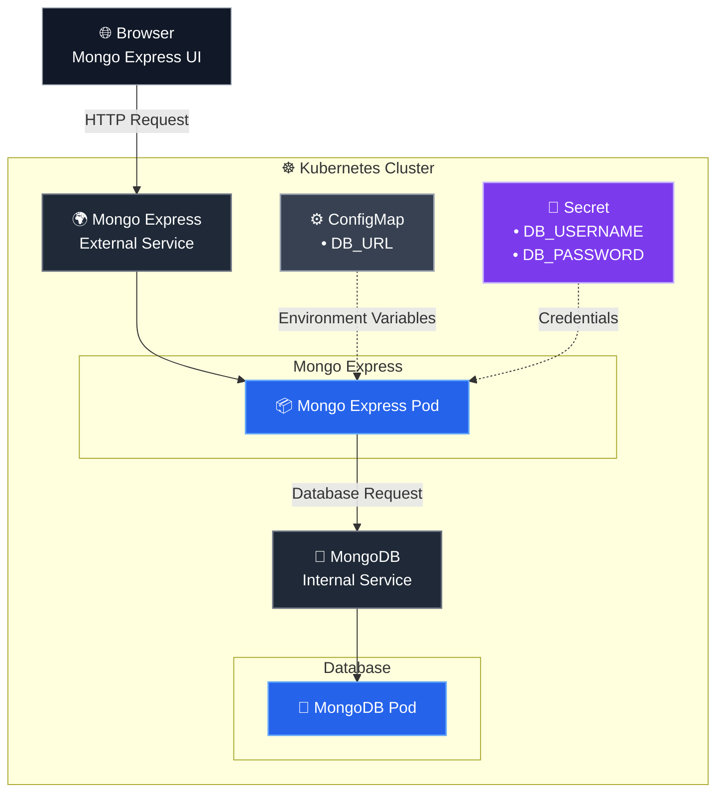

# Kubernetes MongoDB + Mongo Express

A hands-on Kubernetes project demonstrating the deployment of MongoDB and Mongo Express using Deployments, Services, Secrets, and ConfigMaps.

```mermaid
flowchart TB

%% =========================
%% Styles
%% =========================
classDef service fill:#1f2937,color:#fff,stroke:#6b7280,stroke-width:1.5px;
classDef pod fill:#2563eb,color:#fff,stroke:#60a5fa,stroke-width:1.5px;
classDef config fill:#374151,color:#fff,stroke:#9ca3af,stroke-width:1.5px;
classDef secret fill:#7c3aed,color:#fff,stroke:#c4b5fd,stroke-width:1.5px;
classDef user fill:#111827,color:#fff,stroke:#9ca3af;

%% =========================
%% User
%% =========================
Browser["🌐 Browser<br/>Mongo Express UI"]:::user

%% =========================
%% Kubernetes Cluster
%% =========================
subgraph K8S["☸️ Kubernetes Cluster"]

    direction TB

    External["🌍 Mongo Express<br/>External Service"]:::service

    subgraph App["Mongo Express"]
        direction TB
        Express["📦 Mongo Express Pod"]:::pod
    end

    Config["⚙️ ConfigMap<br/>• DB_URL"]:::config

    Secret["🔐 Secret<br/>• DB_USERNAME<br/>• DB_PASSWORD"]:::secret

    Internal["🔗 MongoDB<br/>Internal Service"]:::service

    subgraph DB["Database"]
        Mongo["🍃 MongoDB Pod"]:::pod
    end

end

%% =========================
%% Request Flow
%% =========================
Browser -->|"HTTP Request"| External
External --> Express
Express -->|"Database Request"| Internal
Internal --> Mongo

%% =========================
%% Configuration Dependencies
%% =========================
Config -.->|"Environment Variables"| Express
Secret -.->|"Credentials"| Express
```
